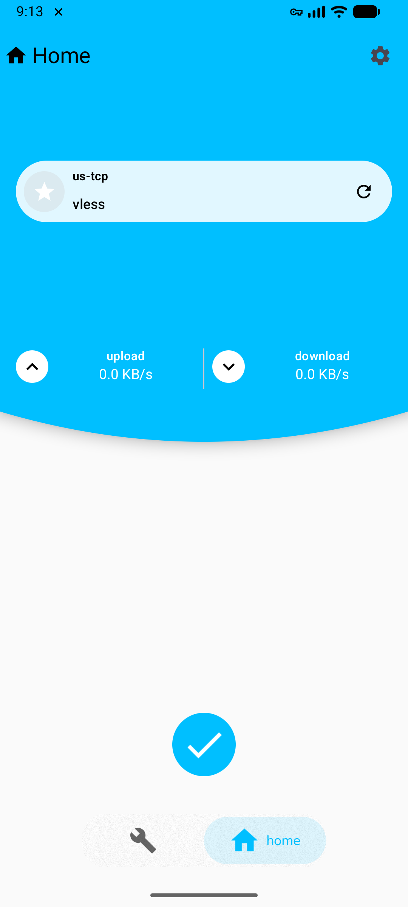
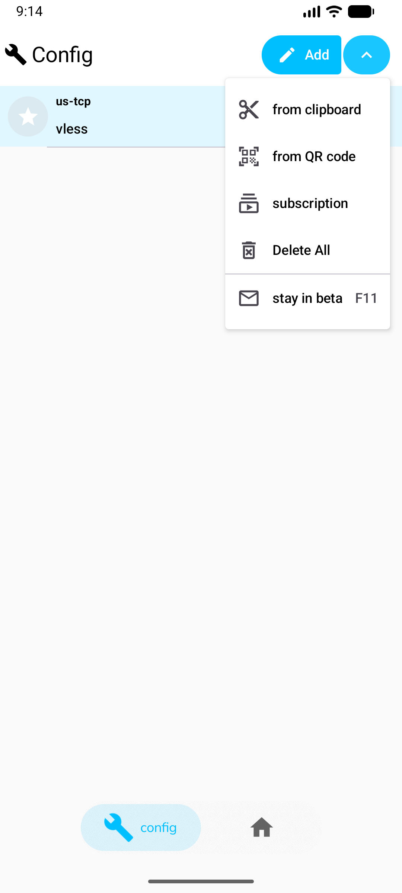
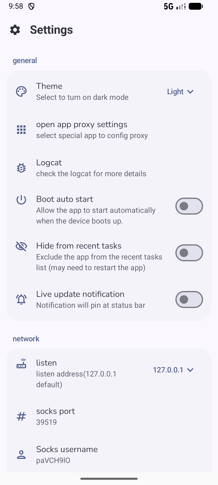

<div align="center">

# 🚀 XrayFA

**一款为 [Xray-core](https://github.com/XTLS/Xray-core) 打造的现代、强大且易用的 Android 客户端。**

XrayFA 专注于简单与性能，为您提供安全、高速的代理体验。

<p align="center">
  <a href="README.md">English</a> | <b>简体中文</b> | <a href="README_RU.md">Русский</a> | <a href="README_KR.md">한글</a>
</p>

[](https://github.com/Q7DF1/XrayFA/releases)
[](https://github.com/Q7DF1/XrayFA/blob/main/LICENSE)
[](https://github.com/Q7DF1/XrayFA)
[](https://github.com/Q7DF1/XrayFA/stargazers)

</div>

---

## 📸 屏幕截图

<div align="center">
    <h3>手机端 UI</h3>
    
    
    
    <br><br>
    <h3>平板 / 折叠屏 UI</h3>
    
</div>

---

## ✨ 功能特性

### 📡 协议支持
| VLESS | VMESS | Shadowsocks | Trojan | Hysteria2 |
| :---: | :---: | :---: | :---: | :---: |
| ✅ | ✅ | ✅ | ✅ | ✅ |

### 🛠️ 核心能力
* **订阅管理**：轻松导入、管理和批量更新订阅链接。
* **直观仪表盘**：实时监控连接状态、速度和流量，界面清晰。
* **丰富配置**：为进阶用户提供高级路由规则和 DNS 设置。
* **流畅体验**：现代化的 Material Design 3 界面，支持流畅动画和深色模式。
* **稳定引擎**：基于最新的 **Xray-core** 构建，确保最佳的兼容性和安全性。

---

## 📥 下载

准备好开始了吗？ 

<div style="display: flex; gap: 10px; align-items: center;">
    <a href="https://github.com/Q7DF1/XrayFA/releases">
        
    </a>
    <a href="https://f-droid.org/en/packages/com.android.xrayfa/">
        
    </a>
</div>

---

## 🔨 源码构建

### 前置条件
* **Android Studio**: 最新稳定版。
* **JDK**: 11 或更高版本。
* **Go (Golang)**: 1.21+（编译 Xray-core 所需）。
* **Git**: 用于克隆子模块。

### 构建步骤

1.  **克隆仓库**（包含子模块）：
    ```bash
    # Clone the repository with submodules
    git clone --recursive [https://github.com/Q7DF1/XrayFA.git](https://github.com/Q7DF1/XrayFA.git)
    cd XrayFA
    ```
    *如果漏掉了子模块：* `git submodule update --init --recursive`

2.  **在 Android Studio 中打开**：
    选择 `XrayFA` 文件夹并等待 Gradle 同步。

3.  **构建并运行**：
    连接您的设备并按下 **Shift + F10**。

> [!CAUTION]
> 🚨 **重要提示**：为了获得准确的性能测试结果，请确保将构建配置设置为 **RELEASE**。[了解更多关于 Compose 性能的信息](https://medium.com/androiddevelopers/why-should-you-always-test-compose-performance-in-release-4168dd0f2c71)。

---

## 📖 快速开始

1.  **导入配置**：
    * 点击 **+** 按钮从剪贴板导入（支持 `vless://`、`vmess://` 等）。
    * 或者扫描 **二维码**。
2.  **管理订阅**：
    * 前往 **订阅设置** 添加服务商 URL。
3.  **连接**：
    * 选择一个节点并点击 **悬浮操作按钮**。
    * 接受 VPN 权限请求。

---

## 🔗 鸣谢

特别感谢这些使 XrayFA 成为可能的项目：
* [Xray-core](https://github.com/XTLS/Xray-core) - 核心网络引擎。
* [AndroidLibXrayLite](https://github.com/2dust/AndroidLibXrayLite)
* [hev-socks5-tunnel](https://github.com/heiher/hev-socks5-tunnel)

## 📄 许可证

本项目采用 **Apache-2.0 许可证**。详见 [LICENSE](LICENSE) 文件。

---
<div align="center">

### 🌟 Star 历史

[](https://star-history.com/q7df1/xrayFA)

</div>
