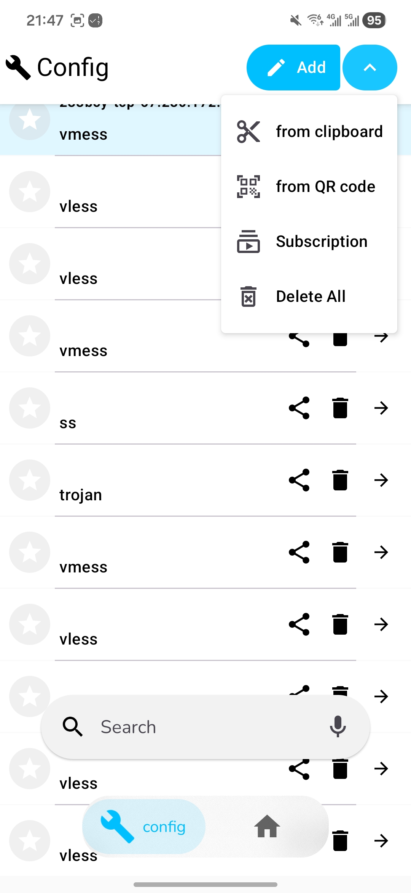
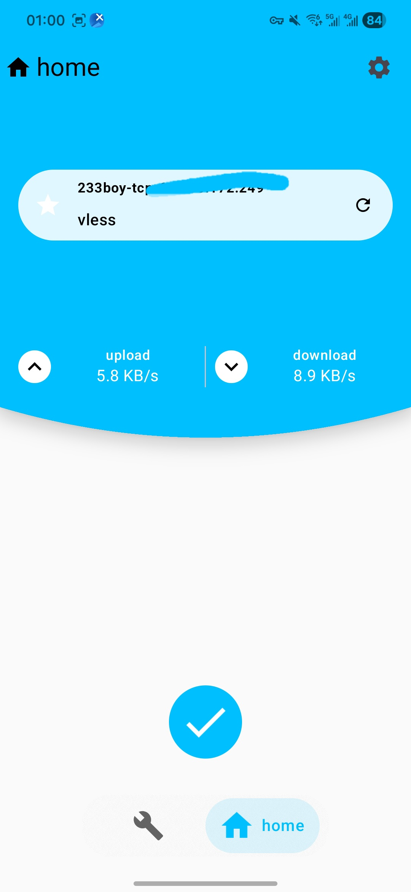
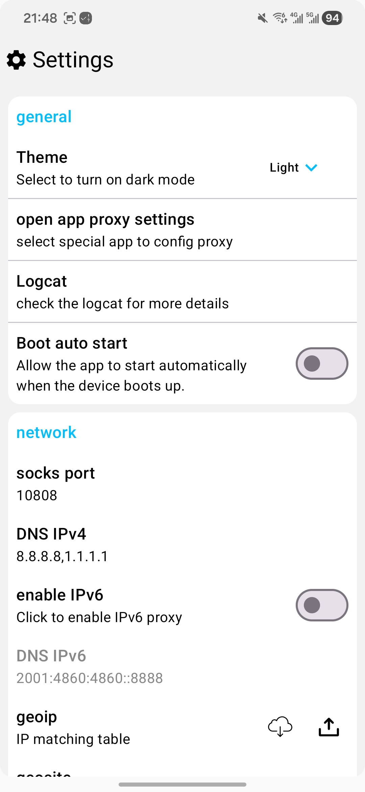

# 🚀 [XrayFA](https://github.com/Q7DF1/XrayFA)

**XrayFA** 是一款功能强大且用户友好的 Android 客户端，基于 [Xray-core](https://github.com/XTLS/Xray-core) 开发。它旨在为 Android 设备提供安全、快速的代理体验，支持包括 VLESS、VMESS、Shadowsocks 和 Trojan 在内的多种主流协议。

**[English](../README.md)|简体中文**。


---

## 📸  界面预览

- 手机设备
<p aligin="center">
    
    
    
</p>
- 平板设备
<p aligin="center">
    
</p>


## ✨ 功能特性

* **多协议支持**：全面支持 VLESS、VMESS、SHADOWSOCKS 和 TROJAN 协议。
* **订阅管理**：轻松添加、管理和更新订阅链接。
* **直观的控制面板**：界面简洁清爽，可实时查看连接状态和流量数据。
* **丰富的配置选项**：为进阶用户提供高级设置，支持精细化调整连接参数。
* **流畅的 UI 体验**：采用现代化的 Material Design 设计语言，配合丰富的交互动画。
* **核心驱动**：基于稳健的 Xray-core 构建，确保连接稳定性。

## 📥 下载安装

您可以从 **[Releases 页面](https://github.com/Q7DF1/XrayFA/releases)** 下载最新的 APK 安装包。

## 🛠️ 源码编译

如果您想从源码构建 XrayFA，需要安装 Android Studio 并具备基础的 Android 开发知识。

### 环境准备

* Android Studio (推荐使用最新的稳定版本)
* **JDK 11 或更高版本**
* **Go (Golang) 环境** (推荐 1.21 或更高版本，用于编译 Xray-core)
* Git

### 编译步骤

1.  **克隆仓库**
    确保在克隆时包含子模块（Submodules），以获取必要的库文件（如 `AndroidLibXrayLite` 和 `tun2socks`）。
    ```bash
    # Clone the repository with submodules
    git clone --recursive [https://github.com/Q7DF1/XrayFA.git](https://github.com/Q7DF1/XrayFA.git)
    cd XrayFA
    ```

    *如果您已经克隆了项目但没有包含子模块，请运行：*
    ```bash
    # Update and initialize submodules
    git submodule update --init --recursive
    ```

2.  **在 Android Studio 中打开**
    * 启动 Android Studio。
    * 选择 "Open an existing project"。
    * 浏览并选择 `XrayFA` 文件夹。

3.  **同步 Gradle**
    * 等待 Android Studio 下载依赖项并完成项目同步。

4.  **构建与运行**
    * 连接您的 Android 设备或启动模拟器。
    * 点击绿色的 **Run** 按钮 (Shift + F10)。

## 📖 使用指南

1.  **导入配置**：
    * 复制您的 `vless://`、`vmess://` 等节点链接。
    * 打开 XrayFA，点击 **+** (添加) 按钮或选择“从剪贴板导入”。
    * 您也可以通过扫描二维码进行添加。
2.  **添加订阅**：
    * 进入“订阅设置”。
    * 粘贴您的订阅链接并执行更新。
3.  **连接代理**：
    * 从列表中选择您心仪的配置文件。
    * 点击底部的 **连接** 按钮 (悬浮按钮) 启动 VPN 服务。
    * 在系统弹出提示时，授予 VPN 连接权限。

## 🤝 参与贡献

我们非常欢迎各种形式的贡献！如果您发现了 Bug 或有新的功能建议，请提交 Issue。

1.  Fork 本项目
2.  创建您的特性分支 (`git checkout -b feature/AmazingFeature`)
3.  提交您的修改 (`git commit -m 'Add some AmazingFeature'`)
4.  推送到分支 (`git push origin feature/AmazingFeature`)
5.  提交 Pull Request (PR)

## 🔗 致谢与参考

本项目离不开以下开源项目的支持：

* **[Xray-core](https://github.com/XTLS/Xray-core)**：核心网络引擎。
* **[AndroidLibXrayLite](https://github.com/2dust/AndroidLibXrayLite)**
* **[hev-socks5-tunnel](https://github.com/heiher/hev-socks5-tunnel)**

## 📄 开源协议

本项目采用 Apache-2.0 协议进行分发。详情请参阅 `LICENSE` 文件。

## 🌟 Star 历史

[](https://star-history.com/q7df1/xrayFA&Date)